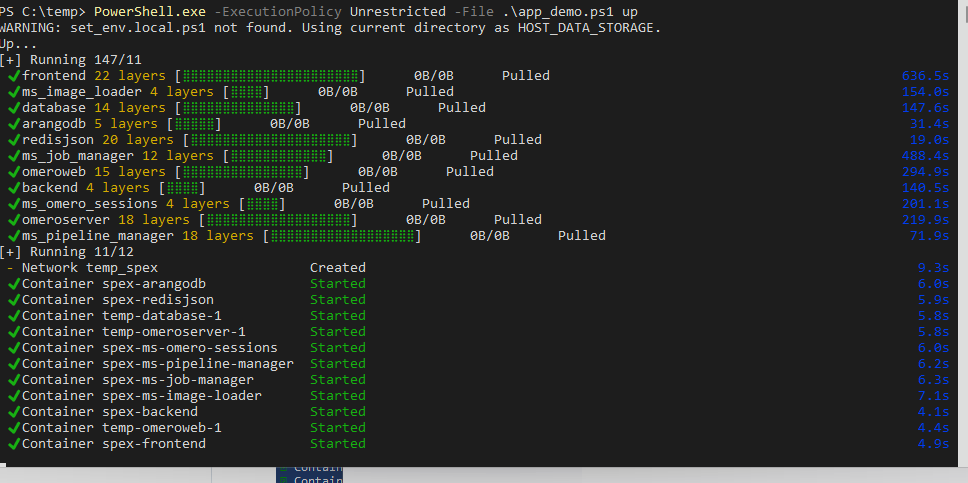

<details open> <summary><b> System Requirements and Internet Connectivity</b></summary>

---

Before beginning the installation process, ensure your system meets the following requirements:

- **Storage Space:** A minimum of 70 GB of free disk space is required for installation and initial operations. It is recommended to have up to 150 GB of free space to accommodate future updates and data management needs.
- Better have 500gb (if yo need to look example data from lfs server )

- **Memory:** At least 16 GB of RAM is essential for smooth performance during installation and runtime.

- **Internet Connection:** A stable internet connection is necessary throughout the installation process and for initial task executions. This ensures timely downloads and updates.

- **3000, 80 Ports:** If, for some reason, ports are not open in Docker, you may need to open ports 80 and 3000 for Docker, or you might have to disable the firewall.

- In the Docker settings under Resources, set a minimum of **8 GB Memory** limit.

  <details><summary>Allow windows</summary>

  
  <details>
---
</details>

## Please note that the demo server includes large datasets, which may result in lengthy download times. The time required will depend on your network speed and stability, so if any step appears to stall, you may pause with `Control+C` and restart as needed to continue the download process.
<details open><summary>Datasets with which you can work are embedded in the repository at the links below</summary>
  <details><summary>IMC Tonsil</summary>

- [IMC_Tonsil.ome.tiff](demo_data/Datasets/IMC_Tonsil/IMC_Tonsil.ome.tiff)
  </details>
  <details><summary>IMC PDAC</summary>

- [IMC_PDAC_ROI1.ome.tiff](demo_data/Datasets/IMC_PDAC/IMC_PDAC_ROI1.ome.tiff)
- [IMC_PDAC_ROI2.ome.tiff](demo_data/Datasets/IMC_PDAC/IMC_PDAC_ROI2.ome.tiff)
- [IMC_PDAC_ROI3.ome.tiff](demo_data/Datasets/IMC_PDAC/IMC_PDAC_ROI3.ome.tiff)
- [IMC_PDAC_ROI4.ome.tiff](demo_data/Datasets/IMC_PDAC/IMC_PDAC_ROI4.ome.tiff)
  </details>
  <details><summary>MIBI TNBC</summary>

- [TA459_multipleCores2_Run-4_Point1.tiff](demo_data/Datasets/MIBI_TNBC/TA459_multipleCores2_Run-4_Point1.tiff)
- [TA459_multipleCores2_Run-4_Point10.tiff](demo_data/Datasets/MIBI_TNBC/TA459_multipleCores2_Run-4_Point10.tiff)
- [TA459_multipleCores2_Run-4_Point11.tiff](demo_data/Datasets/MIBI_TNBC/TA459_multipleCores2_Run-4_Point11.tiff)
- [TA459_multipleCores2_Run-4_Point12.tiff](demo_data/Datasets/MIBI_TNBC/TA459_multipleCores2_Run-4_Point12.tiff)
- [TA459_multipleCores2_Run-4_Point13.tiff](demo_data/Datasets/MIBI_TNBC/TA459_multipleCores2_Run-4_Point13.tiff)
- [TA459_multipleCores2_Run-4_Point14.tiff](demo_data/Datasets/MIBI_TNBC/TA459_multipleCores2_Run-4_Point14.tiff)
- [TA459_multipleCores2_Run-4_Point15.tiff](demo_data/Datasets/MIBI_TNBC/TA459_multipleCores2_Run-4_Point15.tiff)
- [TA459_multipleCores2_Run-4_Point16.tiff](demo_data/Datasets/MIBI_TNBC/TA459_multipleCores2_Run-4_Point16.tiff)
- [TA459_multipleCores2_Run-4_Point17.tiff](demo_data/Datasets/MIBI_TNBC/TA459_multipleCores2_Run-4_Point17.tiff)
- [TA459_multipleCores2_Run-4_Point18.tiff](demo_data/Datasets/MIBI_TNBC/TA459_multipleCores2_Run-4_Point18.tiff)
- [TA459_multipleCores2_Run-4_Point19.tiff](demo_data/Datasets/MIBI_TNBC/TA459_multipleCores2_Run-4_Point19.tiff)
- [TA459_multipleCores2_Run-4_Point2.tiff](demo_data/Datasets/MIBI_TNBC/TA459_multipleCores2_Run-4_Point2.tiff)
- [TA459_multipleCores2_Run-4_Point20.tiff](demo_data/Datasets/MIBI_TNBC/TA459_multipleCores2_Run-4_Point20.tiff)
- [TA459_multipleCores2_Run-4_Point21.tiff](demo_data/Datasets/MIBI_TNBC/TA459_multipleCores2_Run-4_Point21.tiff)
- [TA459_multipleCores2_Run-4_Point22.tiff](demo_data/Datasets/MIBI_TNBC/TA459_multipleCores2_Run-4_Point22.tiff)
- [TA459_multipleCores2_Run-4_Point23.tiff](demo_data/Datasets/MIBI_TNBC/TA459_multipleCores2_Run-4_Point23.tiff)
- [TA459_multipleCores2_Run-4_Point24.tiff](demo_data/Datasets/MIBI_TNBC/TA459_multipleCores2_Run-4_Point24.tiff)
- [TA459_multipleCores2_Run-4_Point25.tiff](demo_data/Datasets/MIBI_TNBC/TA459_multipleCores2_Run-4_Point25.tiff)
- [TA459_multipleCores2_Run-4_Point26.tiff](demo_data/Datasets/MIBI_TNBC/TA459_multipleCores2_Run-4_Point26.tiff)
- [TA459_multipleCores2_Run-4_Point27.tiff](demo_data/Datasets/MIBI_TNBC/TA459_multipleCores2_Run-4_Point27.tiff)
- [TA459_multipleCores2_Run-4_Point28.tiff](demo_data/Datasets/MIBI_TNBC/TA459_multipleCores2_Run-4_Point28.tiff)
- [TA459_multipleCores2_Run-4_Point29.tiff](demo_data/Datasets/MIBI_TNBC/TA459_multipleCores2_Run-4_Point29.tiff)
- [TA459_multipleCores2_Run-4_Point3.tiff](demo_data/Datasets/MIBI_TNBC/TA459_multipleCores2_Run-4_Point3.tiff)
- [TA459_multipleCores2_Run-4_Point30.tiff](demo_data/Datasets/MIBI_TNBC/TA459_multipleCores2_Run-4_Point30.tiff)
- [TA459_multipleCores2_Run-4_Point31.tiff](demo_data/Datasets/MIBI_TNBC/TA459_multipleCores2_Run-4_Point31.tiff)
- [TA459_multipleCores2_Run-4_Point32.tiff](demo_data/Datasets/MIBI_TNBC/TA459_multipleCores2_Run-4_Point32.tiff)
- [TA459_multipleCores2_Run-4_Point33.tiff](demo_data/Datasets/MIBI_TNBC/TA459_multipleCores2_Run-4_Point33.tiff)
- [TA459_multipleCores2_Run-4_Point34.tiff](demo_data/Datasets/MIBI_TNBC/TA459_multipleCores2_Run-4_Point34.tiff)
- [TA459_multipleCores2_Run-4_Point35.tiff](demo_data/Datasets/MIBI_TNBC/TA459_multipleCores2_Run-4_Point35.tiff)
- [TA459_multipleCores2_Run-4_Point36.tiff](demo_data/Datasets/MIBI_TNBC/TA459_multipleCores2_Run-4_Point36.tiff)
- [TA459_multipleCores2_Run-4_Point37.tiff](demo_data/Datasets/MIBI_TNBC/TA459_multipleCores2_Run-4_Point37.tiff)
- [TA459_multipleCores2_Run-4_Point38.tiff](demo_data/Datasets/MIBI_TNBC/TA459_multipleCores2_Run-4_Point38.tiff)
- [TA459_multipleCores2_Run-4_Point39.tiff](demo_data/Datasets/MIBI_TNBC/TA459_multipleCores2_Run-4_Point39.tiff)
- [TA459_multipleCores2_Run-4_Point4.tiff](demo_data/Datasets/MIBI_TNBC/TA459_multipleCores2_Run-4_Point4.tiff)
- [TA459_multipleCores2_Run-4_Point40.tiff](demo_data/Datasets/MIBI_TNBC/TA459_multipleCores2_Run-4_Point40.tiff)
- [TA459_multipleCores2_Run-4_Point41.tiff](demo_data/Datasets/MIBI_TNBC/TA459_multipleCores2_Run-4_Point41.tiff)
- [TA459_multipleCores2_Run-4_Point5.tiff](demo_data/Datasets/MIBI_TNBC/TA459_multipleCores2_Run-4_Point5.tiff)
- [TA459_multipleCores2_Run-4_Point6.tiff](demo_data/Datasets/MIBI_TNBC/TA459_multipleCores2_Run-4_Point6.tiff)
- [TA459_multipleCores2_Run-4_Point7.tiff](demo_data/Datasets/MIBI_TNBC/TA459_multipleCores2_Run-4_Point7.tiff)
- [TA459_multipleCores2_Run-4_Point8.tiff](demo_data/Datasets/MIBI_TNBC/TA459_multipleCores2_Run-4_Point8.tiff)
- [TA459_multipleCores2_Run-4_Point9.tiff](demo_data/Datasets/MIBI_TNBC/TA459_multipleCores2_Run-4_Point9.tiff)
  </details>

- [MERFISH NSCLC.h5ad](demo_data/UPLOADS/161065100/merfish_lung.h5ad)
</details>


## SPEX Application Microservices and Architecture

### Core Repositories:
- **Full Application Package** (use submodules for easy cloning of all components):  
  [spex_bundle](https://github.com/Genentech/spex_bundle)

- **Backend**: [spex_backend](https://github.com/Genentech/spex_backend)
- **Frontend**: [spex_frontend](https://github.com/Genentech/spex_frontend)
- **Common Modules**: [spex_common](https://github.com/Genentech/spex_common)

### Microservices:
- **Image Downloader from Omero for Processing**: [spex_ms_omero_image_downloader](https://github.com/Genentech/spex_ms_omero_image_downloader)
- **Omero Session Management** (providing image information and API access): [spex_ms_omero_sessions](https://github.com/Genentech/spex_ms_omero_sessions)
- **Task Queue Manager**: [spex_ms_pipeline_manager](https://github.com/Genentech/spex_ms_pipeline_manager)
- **Script Execution and Environment Management**: [spex_ms_job_manager](https://github.com/Genentech/spex_ms_job_manager)

### Algorithms:
- **Data Clustering**: [spex_clustering](https://github.com/Genentech/spex_clustering)
- **Image Segmentation**: [spex_segmentation](https://github.com/Genentech/spex_segmentation)
- **Spatial Transcriptomics**: [spex_spatial_transcriptomics](https://github.com/Genentech/spex_spatial_transcriptomics)

These algorithms enable customization of data processing parameters and are integrated with the `spex_ms_job_manager` microservice for executing analytical tasks.

# Installation Guide

## Install Git LFS for Managing Large Files

<details><summary><b> Ubuntu</b></summary>

- Open Terminal and run:
```
sudo apt update
sudo apt install git-lfs
```
</details>

<details open><summary><b> Windows</b></summary>

- Download and install [Git for Windows](https://git-scm.com/download/win).
- if you have installed Git for Windows, you can check if running installs Git LFS:
- Open Powershell as administrator and run:
```
git lfs install
```
if you have this output:
```
Git LFS initialized.
```


go to the next step [Bundle installation](#bundle-installation)
, if not
- Download and install [Git LFS](https://git-lfs.github.com/)
  follow the instructions for Windows installation.
</details>


<a id="bundle-installation"></a>
## Bundle Installation

- Go to the folder where you will deploy the project.
To navigate to a project folder in the terminal, you can use the cd command, which stands for "change directory."

```
cd my_project
```

- To set up Git LFS, open the terminal and run the following command:
```
git lfs install
```

- For the production bundle of the application, clone the repository:
```
git clone https://github.com/Genentech/spex_demo.git .

git lfs pull

```
- Wait for the process to complete. The total size of all downloaded project files should be around 10 gigabytes.


<details>
  <summary><b>Set executable permissions (Ubuntu): </b></summary>

  ```
  chmod -R +x .
  ```
</details>

## Install Docker desktop on your Local Machine
- Download and install [Docker Desktop](https://www.docker.com/products/docker-desktop)

### Run application demo script:
<details> <summary><b>Ubuntu</b></summary>

- Execute the application demo script:
  ```
  ./app_demo.sh up
  ```
</details>

<details open> <summary><b>Windows</b></summary>

- Run the PowerShell script by command as administrator:
  ```
  PowerShell.exe -ExecutionPolicy Unrestricted -File .\app_demo.ps1 up
  ```

  
  <details><summary><b>windows 11 time to up</b></summary>
    
    
  </details>
</details>


Wait for the download to complete. If the download does not complete or hangs due to unstable connection, stop the process control+C and start the process again.

After the download is complete and the necessary images and containers are created, you should see 11 containers in the Docker application.

As a result, a browser window should open asking you to log in. If the page is not displayed? Try waiting 5-15 minutes and reload the page. Perhaps the containers have not all had time to collect yet.


**for open application you can start host "http://127.0.0.1:3000" in your browser,
at the first start, I would wait 5 minutes for the services to be initialized, such as the Omero server and frontend.**

for more information about SPEX can use

<details> <summary><b>Working workflow</b></summary>

- login in application use username **root** and password **omero**


- ## create process
  To initiate a test process, first select Project 1 and click the **Analyze** button.
  Next, click the "Add Process" button, and enter the name of the process, such as "test".
  Then, access the process by clicking on it in the process list, and proceed to create the first task.
  
- ## create tasks
  Blocks can be connected to each other; the entry point is the choice of what we work with,
  an image or an anndata file. Subsequently, we select the following related blocks,
  which perform data transformation to achieve the desired result.
  
- ## run tasks
  All tasks are executed sequentially. You can start all tasks using the "Start ▶" button or the "Play ▶"
  button in each block. Also, you can delete a block if it is not needed.
  
  - ## Fix errors
  During the initial launch, related libraries are downloaded from the internet.
  If the internet connection is unstable, the installation may fail, indicated by a red flag over the task name.
  To reinitialize the installation or restart the task, you need to press the play button **▶** as shown below.
  
  - ## View results
  The results of the pipeline execution can be viewed in the review tab.
  If for some reason they are not displayed, you can request the data to be regenerated by pressing the
  "Delete zarr data" button and then the "Create zarr data" button.
  
</details>


<details> <summary><b>Description of the syntax for custom algorithms, how we can integrate our own mechanisms into the system, as well as their parameters.:</b></summary>

All scripts are located inside the project at the path /demo_data/scripts/, where there are three folders containing various scripts that are already used in the project. Any of them can be used as a reference example.
Below, you will also find descriptions of possible modifications that can be applied.
## Project Structure

- **Project root**
  - `manifest.json` — The main project manifest (if used). It may contain global settings or link individual pipeline stages.
  - Other files unrelated to a specific stage.

- **Stage folders** (e.g., `load_anndata`, `clustering`, `dimensionality_reduction`)
  - **`manifest.json`** (inside the stage folder)
    - Describes the key parameters required by this stage.
    - Contains the stage name, description, execution order (`stage`), input parameters (`params`), and expected output (`return`).
    - Defines dependencies (`depends_and_script`, `depends_or_script`) and environment settings (`conda`, `libs`, `conda_pip`).
    - **Conda Environments**: If `conda` is specified, the system creates or uses a Conda environment with the requested Python version and installs the necessary libraries (`libs` via Conda, `conda_pip` via pip).
    - **Parameter Definitions**: The `params` section in `manifest.json` must include precise details for all possible parameter types to ensure smooth communication between the client and the script.
    - **Result Transfer**: The result of each script is passed to the next stage through the structured output format defined in `return`.

  - **`app.py`** (the executable script for this stage)
    - This file must always be named `app.py` to maintain consistency.
    - It contains the core logic: reading data, processing it, and returning results.
    - Typically includes a `run(**kwargs)` function that:
      1. **Imports necessary dependencies** (e.g., `scanpy`, `numpy`).
      2. **Reads parameters** from `kwargs` (e.g., file paths, method choices, metrics).
      3. **Executes core functions** (e.g., data loading, clustering, dimensionality reduction).
      4. **Returns results** in the format defined in `manifest.json`.

## Parameter Types and Manifest Definitions

Each stage's `manifest.json` should specify parameters under `params` using the following structure:

```json
"params": {
    "parameter_name": {
        "name": "Parameter Name",
        "label": "User-friendly label",
        "description": "Detailed description of the parameter",
        "type": "TYPE",
        "required": true,
        "default": "default_value",
        "enum": ["option1", "option2"],
        "min": 0,
        "max": 100
    }
}
```

### Supported Parameter Types

#### Basic Types
| Type       | Description & Manifest Example |
|------------|--------------------------------|
| `string`   | A text field. `{ "type": "string" }` |
| `int`      | Integer input. `{ "type": "int", "min": 0, "max": 100 }` |
| `float`    | Floating-point number. `{ "type": "float", "min": 0.0, "max": 1.0 }` |
| `enum`     | A dropdown selection. `{ "type": "enum", "enum": ["option1", "option2"] }` |

#### File and Data Types
| Type       | Description & Manifest Example |
|------------|--------------------------------|
| `file`     | A file selector. `{ "type": "file" }` |
| `dataGrid` | A structured table/grid input. `{ "type": "dataGrid" }` |

#### Image and Channel Selection
| Type       | Description & Manifest Example |
|------------|--------------------------------|
| `omero`    | Image selection from OMERO. `{ "type": "omero" }` |
| `channel`  | A single channel selector. `{ "type": "channel" }` |
| `channels` | Multi-channel selector. `{ "type": "channels" }` |

#### Job and Process Selection
| Type       | Description & Manifest Example |
|------------|--------------------------------|
| `job_id`   | A job selector. `{ "type": "job_id" }` |
| `process_job_id` | A process job selector. `{ "type": "process_job_id" }` |

These types are mapped to their respective React components in the UI, ensuring proper handling on the client-side.

## Supported File Formats

### **1. Image and Microscopy Data Formats (OMERO)**
OMERO supports various image formats, excluding those with a time dimension (e.g., time-lapse TIFFs).

| Format        | Description |
|--------------|-------------|
| **TIFF (.tif, .tiff)** | Multi-channel, multi-dimensional image storage widely used in microscopy. |
| **OME-TIFF (.ome.tif, .ome.tiff)** | A standardized format supporting structured metadata and multiple channels (CXY or CYXZ). |

**Unsupported Formats:**
- **TIFF stacks with time dimension (TXYC or TXYZC)** → Not supported for direct OMERO ingestion in this workflow.

### **2. AnnData File Format (H5AD)**
H5AD is a format used for storing annotated multi-dimensional data, particularly in single-cell transcriptomics and spatial biology.

#### **H5AD File Structure**
- **Observations (Cells or Regions) (`adata.obs`)**
  - `fov`, `volume`, `min_x`, `max_x`, `min_y`, `max_y` — Metadata defining spatial boundaries and properties.

- **Variables (Genes or Features) (`adata.var`)**
  - Contains `n_vars` variables (e.g., genes), with no additional annotations.

- **Spatial Data (`adata.obsm`, `adata.uns`)**
  - Stores spatial coordinates and additional metadata.

#### **Manifest Definition for H5AD Files**
```json
{
  "params": {
    "adata": {
      "name": "AnnData File",
      "label": "Spatial transcriptomics dataset",
      "description": "H5AD file containing spatial gene expression data",
      "type": "file",
      "required": true
    }
  }
}
```
</details>