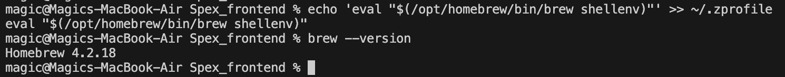
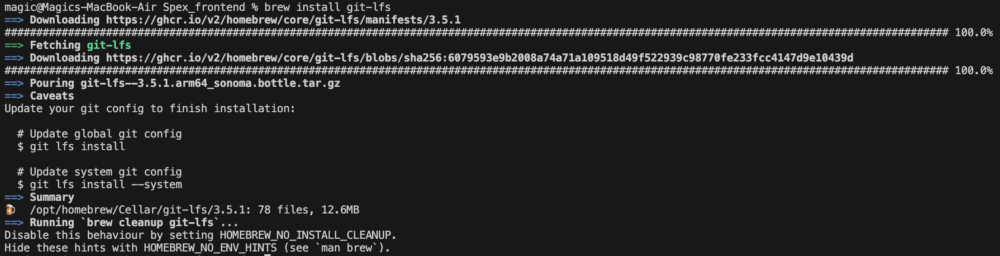

<details open> <summary><b> System Requirements and Internet Connectivity</b></summary>

---

Before beginning the installation process, ensure your system meets the following requirements:

- **Storage Space:** A minimum of 70 GB of free disk space is required for installation and initial operations. It is recommended to have up to 150 GB of free space to accommodate future updates and data management needs.

- **Memory:** At least 16 GB of RAM is essential for smooth performance during installation and runtime.

- **Internet Connection:** A stable internet connection is necessary throughout the installation process and for initial task executions. This ensures timely downloads and updates.

- **3000, 80 Ports:** If, for some reason, ports are not open in Docker, you may need to open ports 80 and 3000 for Docker, or you might have to disable the firewall.

- In the Docker settings under Resources, set a minimum of **8 GB Memory** limit.

  <details><summary>Allow windows</summary>

  
  <details>
---
</details>

# Installation Guide

## Install Git LFS for Managing Large Files

<details><summary><b> Ubuntu</b></summary>

- Open Terminal and run:
```
sudo apt update
sudo apt install git-lfs
```
</details>


<details><summary><b> MacOs Apple silicon</b></summary>

#### 1. Open the Terminal application

To open the Terminal on a Mac:
- Open Launchpad.
- Click on the Other folder.
- Click on the Terminal icon to open it.


#### 2. Install Homebrew

Install homebrew if you don't already have it
- During the Homebrew installation process, you may need to confirm that you want to proceed. Just follow the on-screen instructions.
```
/bin/bash -c "$(curl -fsSL https://raw.githubusercontent.com/Homebrew/install/HEAD/install.sh)"
```

  

- Add Homebrew to the PATH environment variable in Zsh:
```
echo 'eval "$(/opt/homebrew/bin/brew shellenv)"' >> ~/.zprofile
eval "$(/opt/homebrew/bin/brew shellenv)"
```
- Once the Homebrew installation is complete, verify that it is installed correctly by running the command:
```
brew --version
```


#### 3. Install Git

Download and install Git for macOs</b>

```
brew install git
```
More info [Git for macOs](https://git-scm.com/download/mac).


#### 4. Install Git LFS for Managing Large Files

```
brew install git-lfs
```

More info [Git for Git LFS](https://git-lfs.com/).




</details>


<details open><summary><b> Windows</b></summary>

- Download and install [Git for Windows](https://git-scm.com/download/win).
- if you have installed Git for Windows, you can check if running installs Git LFS:
- Open Powershell as administrator and run:
```
git lfs install
```
if you have this output:
```
Git LFS initialized.
```


go to the next step [Bundle installation](#bundle-installation)
, if not
- Download and install [Git LFS](https://git-lfs.github.com/)
  follow the instructions for Windows installation.
</details>


<a id="bundle-installation"></a>
## Bundle Installation

- Go to the folder where you will deploy the project.
To navigate to a project folder in the terminal, you can use the cd command, which stands for "change directory."

```
cd my_project
```

- To set up Git LFS, open the terminal and run the following command:
```
git lfs install
```

- For the production bundle of the application, clone the repository:
```
git clone https://github.com/Genentech/spex_demo.git .

git lfs pull

```
- Wait for the process to complete. The total size of all downloaded project files should be around 10 gigabytes.


<details>
  <summary><b>Set executable permissions (Ubuntu): </b></summary>

  ```
  chmod -R +x .
  ```
</details>

## Install Docker desktop on your Local Machine
- Download and install [Docker Desktop](https://www.docker.com/products/docker-desktop)

### Run application demo script:
<details> <summary><b>Ubuntu</b></summary>

- Execute the application demo script:
  ```
  ./app_demo.sh up
  ```
</details>
  <details><summary><b> MacOs Apple silicon</b></summary>
  Execute the application demo script:

- Set permissions to execute the script
  ```
  chmod +x app_demo_silicon.sh
  ``` 
- Run the script
  ```
  ./app_demo_silicon.sh up
  ```


</details>
<details open> <summary><b>Windows</b></summary>

- Run the PowerShell script by command as administrator:
  ```
  PowerShell.exe -ExecutionPolicy Unrestricted -File .\app_demo.ps1 up
  ```

  
  <details><summary><b>windows 11 time to up</b></summary>
    
    
  </details>
</details>


Wait for the download to complete. If the download does not complete or hangs due to unstable connection, stop the process control+C and start the process again.

After the download is complete and the necessary images and containers are created, you should see 11 containers in the Docker application.

As a result, a browser window should open asking you to log in. If the page is not displayed? Try waiting 5-15 minutes and reload the page. Perhaps the containers have not all had time to collect yet.


**for open application you can start host "http://127.0.0.1:3000" in your browser,
at the first start, I would wait 5 minutes for the services to be initialized, such as the Omero server and frontend.**

for more information about SPEX can use

<details> <summary><b>Working workflow</b></summary>

- login in application use username **root** and password **omero**


- ## create process
  To initiate a test process, first select Project 1 and click the **Analyze** button.
  Next, click the "Add Process" button, and enter the name of the process, such as "test".
  Then, access the process by clicking on it in the process list, and proceed to create the first task.
  
- ## create tasks
  Blocks can be connected to each other; the entry point is the choice of what we work with,
  an image or an anndata file. Subsequently, we select the following related blocks,
  which perform data transformation to achieve the desired result.
  
- ## run tasks
  All tasks are executed sequentially. You can start all tasks using the "Start ▶" button or the "Play ▶"
  button in each block. Also, you can delete a block if it is not needed.
  
  - ## Fix errors
  During the initial launch, related libraries are downloaded from the internet.
  If the internet connection is unstable, the installation may fail, indicated by a red flag over the task name.
  To reinitialize the installation or restart the task, you need to press the play button **▶** as shown below.
  
  - ## View results
  The results of the pipeline execution can be viewed in the review tab.
  If for some reason they are not displayed, you can request the data to be regenerated by pressing the
  "Delete zarr data" button and then the "Create zarr data" button.
  
</details>