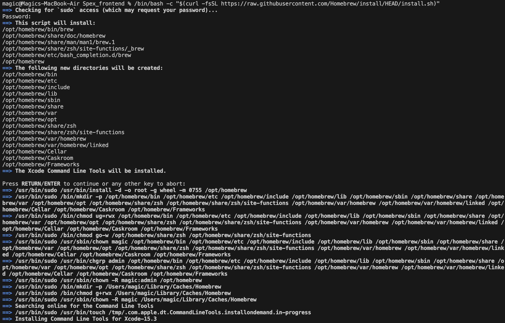

<details open> <summary><b> System Requirements and Internet Connectivity</b></summary>

---

Before beginning the installation process, ensure your system meets the following requirements:

- **Storage Space:** A minimum of 70 GB of free disk space is required for installation and initial operations. It is recommended to have up to 150 GB of free space to accommodate future updates and data management needs.

- **Memory:** At least 8 GB of RAM is essential for smooth performance during installation and runtime.

- **Internet Connection:** A stable internet connection is necessary throughout the installation process and for initial task executions. This ensures timely downloads and updates.

- **3000, 80 Ports:** If, for some reason, ports are not open in Docker, you may need to open ports 80 and 3000 for Docker, or you might have to disable the firewall.


# Installation Guide for macOS

## 1. Open the Terminal application

<details open><summary><b>To open the Terminal on a Mac:</b></summary>

- Open Launchpad.
- Click on the Other folder.
- Click on the Terminal icon to open it.


</details>

## 2. Install Homebrew

<details open><summary><b>Install homebrew if you don't already have it</b></summary>

- During the Homebrew installation process, you may need to confirm that you want to proceed. Just follow the on-screen instructions.
```
/bin/bash -c "$(curl -fsSL https://raw.githubusercontent.com/Homebrew/install/HEAD/install.sh)"
```

  

- Add Homebrew to the PATH environment variable in Zsh:
```
echo 'eval "$(/opt/homebrew/bin/brew shellenv)"' >> ~/.zprofile
eval "$(/opt/homebrew/bin/brew shellenv)"
```
- Once the Homebrew installation is complete, verify that it is installed correctly by running the command:
```
brew --version
```

</details>

## 3. Install Git

<details open><summary><b>Download and install Git for macOs</b></summary>

```
brew install git
```
More info [Git for macOs](https://git-scm.com/download/mac).

</details>

## 4. Install Git LFS for Managing Large Files

<details open><summary><b>Install Git LFS</b></summary>

```
brew install git-lfs
```


More info [Git for Git LFS](https://git-lfs.com/).
</details>


<a id="bundle-installation"></a>
## 5. Bundle Installation

<details open><summary><b>Go to the folder where you will deploy the project:</b></summary>
To navigate to a project folder in the terminal, you can use the cd command, which stands for "change directory."

```
cd my_project
```
</details>

<details open><summary><b>To configure Git LFS run the following command:</b></summary>

```
git lfs install
```


</details>

<details open><summary><b>For the production bundle of the application, clone the repository:</b></summary>

```
git clone https://github.com/Genentech/spex_demo.git .
```
Wait for the process to complete. The total size of all downloaded project files should be around 10 gigabytes.


</details>


## 6. Install Docker desktop on your Local Machine
- Download and install [Docker Desktop](https://www.docker.com/products/docker-desktop)
  
<details> <summary><b>Important: In the Docker settings under Resources, set a minimum of 8 GB Memory limit.</b></summary>


- Wait for the download to complete. If the download does not complete or hangs due to unstable connection, stop the process control+C and start the process again.
- After the download is complete and the necessary images and containers are created, you should see 11 containers in the Docker application.
- As a result, a browser window should open asking you to log in. If the page is not displayed? Try waiting 5-10 minutes and reload the page. Perhaps the containers have not all had time to collect yet.
</details>


## 7. Run application demo script:
<details> <summary><b>Execute the application demo script:</b></summary>

  ```
  ./app_demo_silicon.sh up
  ```

- Wait for the download to complete. If the download does not complete or hangs due to unstable connection, stop the process control+C and start the process again.
- After the download is complete and the necessary images and containers are created, you should see 11 containers in the Docker application.
- As a result, a browser window should open asking you to log in. If the page is not displayed? Try waiting 5-10 minutes and reload the page. Perhaps the containers have not all had time to collect yet.
</details>

**For open application you can start host "http://127.0.0.1:3000" in your browser,
at the first start, I would wait 5 minutes for the services to be initialized, such as the Omero server and frontend.**


## Working workflow

<details> <summary><b>Working workflow</b></summary>

- login in application use username **root** and password **omero**


- ## create process
  To initiate a test process, first select Project 1 and click the **Analyze** button.
  Next, click the "Add Process" button, and enter the name of the process, such as "test".
  Then, access the process by clicking on it in the process list, and proceed to create the first task.
  
- ## create tasks
  Blocks can be connected to each other; the entry point is the choice of what we work with,
  an image or an anndata file. Subsequently, we select the following related blocks,
  which perform data transformation to achieve the desired result.
  
- ## run tasks
  All tasks are executed sequentially. You can start all tasks using the "Start ▶" button or the "Play ▶"
  button in each block. Also, you can delete a block if it is not needed.
  
  - ## Fix errors
  During the initial launch, related libraries are downloaded from the internet.
  If the internet connection is unstable, the installation may fail, indicated by a red flag over the task name.
  To reinitialize the installation or restart the task, you need to press the play button **▶** as shown below.
  
  - ## View results
  The results of the pipeline execution can be viewed in the review tab.
  If for some reason they are not displayed, you can request the data to be regenerated by pressing the
  "Delete zarr data" button and then the "Create zarr data" button.
  
</details>