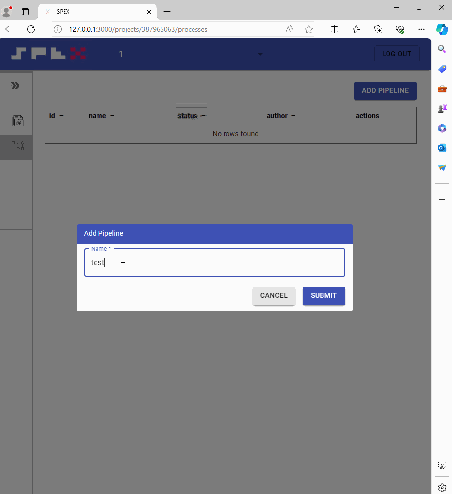

Working workflow
- login in application use username **root** and password **omero**

- ## create process
  To initiate a test process, first select Project 1 and click the **Analyze** button. 
  Next, click the "Add Process" button, and enter the name of the process, such as "test". 
  Then, access the process by clicking on it in the process list, and proceed to create the first task.
  
- ## create tasks 
  Blocks can be connected to each other; the entry point is the choice of what we work with, 
  an image or an anndata file. Subsequently, we select the following related blocks, 
  which perform data transformation to achieve the desired result.
  
- ## run tasks
  All tasks are executed sequentially. You can start all tasks using the "Start ▶" button or the "Play ▶"
  button in each block. Also, you can delete a block if it is not needed.
   
  - ## Fix errors 
  During the initial launch, related libraries are downloaded from the internet. 
  If the internet connection is unstable, the installation may fail, indicated by a red flag over the task name.
  To reinitialize the installation or restart the task, you need to press the play button **▶** as shown below.
  
  - ## View results
  The results of the pipeline execution can be viewed in the review tab. 
  If for some reason they are not displayed, you can request the data to be regenerated by pressing the 
  "Delete zarr data" button and then the "Create zarr data" button.
  
  